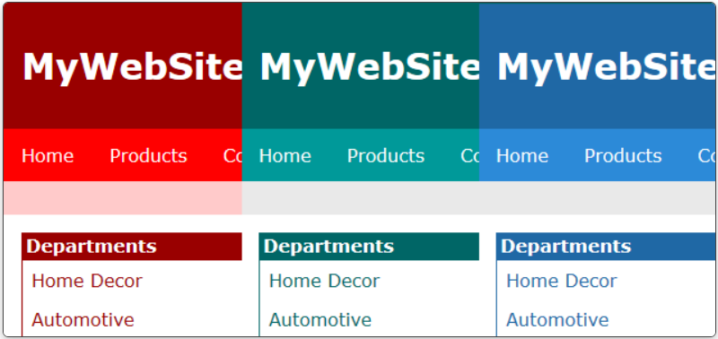

# Back-to-Basics

A simple front-end project demonstrating a reusable website template with three color theme variants: blue, green, and red.

Each theme includes the same set of site pages and shared CSS structure, showing how consistent styling and layout can reduce code duplication and simplify maintenance.

